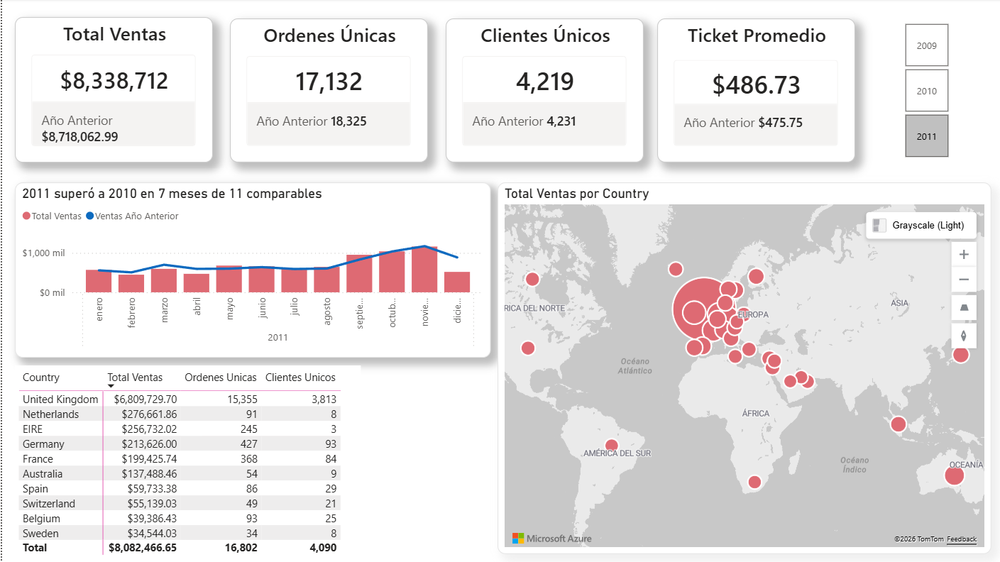
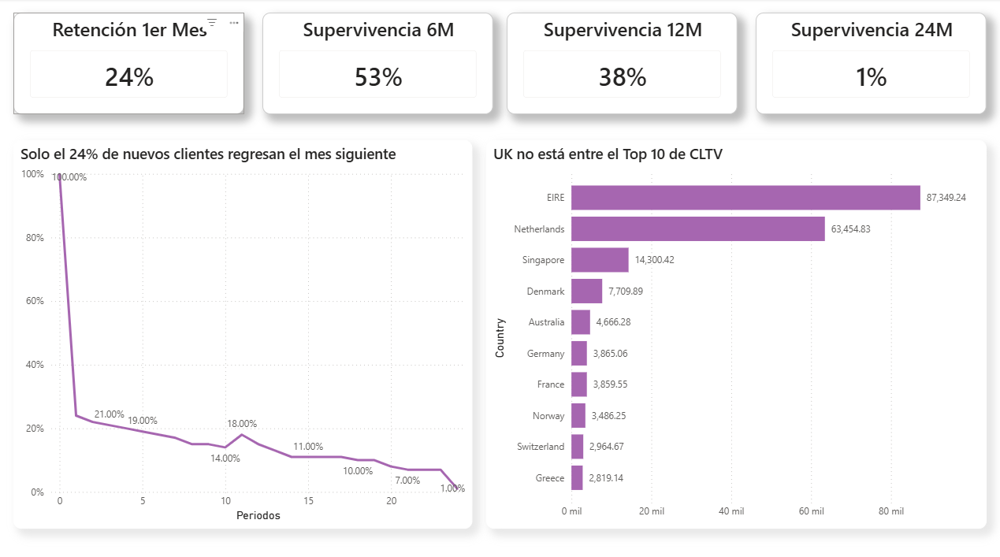
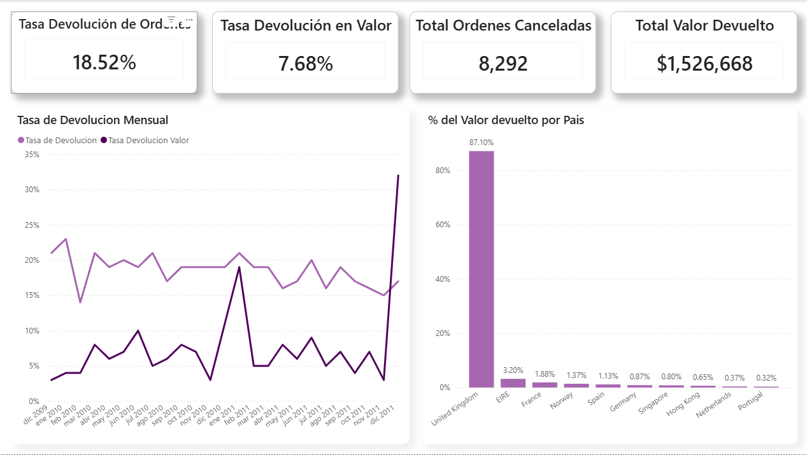

# 🛒 Análisis de Ventas — Online Retail UK (2009-2011)

## 📋 Descripción del Proyecto

Análisis completo de una tienda online del Reino Unido especializada en artículos de regalo, con operaciones entre diciembre 2009 y diciembre 2011. El objetivo es identificar tendencias de ventas, comportamiento de clientes y riesgos operativos para apoyar decisiones estratégicas de negocio.

---

## 🛠️ Herramientas Utilizadas

- **MySQL 8.0** — limpieza, transformación y análisis de datos
- **Power BI Desktop** — visualización y dashboard ejecutivo
- **DAX** — medidas y cálculos de inteligencia de tiempo

---

## 📂 Estructura del Repositorio

```
online-retail-analysis/
│
├── README.md
├── Analisis.sql                          -- Queries completas de análisis
├── Online_Retail2.pbix                   -- Dashboard Power BI
└── Dashboard_Online_Retail/
    ├── Resumen_Ejecutivo.png
    ├── Comportamiento_Clientes.png
    └── Riesgos_y_devolucion.png
```

---

## 📊 Dataset

| Característica | Detalle |
|----------------|---------|
| Fuente | UCI Machine Learning Repository |
| Periodo | Diciembre 2009 — Diciembre 2011 |
| Registros | 1,067,371 transacciones |
| Registros limpios | 1,041,652 transacciones |
| Clientes únicos | 5,878 |
| Países | 38 |

---

## 🔍 Preguntas de Negocio

1. ¿Cómo evolucionaron las ventas mes a mes y cómo se comparan contra el año anterior?
2. ¿Qué porcentaje de clientes regresa después de su primera compra?
3. ¿Qué mercados internacionales generan mayor valor por cliente?
4. ¿Cuál es la tasa de devoluciones y en qué meses se concentra el riesgo?

---

## 💡 Hallazgos Principales

### Tendencias de Ventas
- Las ventas totales del periodo fueron de **$17,743,429**
- 2011 superó a 2010 en **7 de 11 meses comparables**, con un crecimiento destacado en septiembre (+14.58%) y mayo (+13.10%)
- Los meses de **septiembre a noviembre** concentran los picos de venta por temporada navideña
- **Febrero** es el mes más débil con un promedio de $476,754 — típico comportamiento post-navidad

### Comportamiento de Clientes
- Solo el **24% de los clientes regresa al mes siguiente** de su primera compra
- El **53%** de los clientes tuvo actividad durante al menos 6 meses
- El **38%** mantuvo actividad durante 12 meses o más
- **EIRE y Netherlands** lideran el CLTV promedio con $87,349 y $63,454 respectivamente — clientes mayoristas de alto valor
- **UK no aparece en el Top 10 de CLTV** a pesar de representar el 84% de las ventas en volumen

### Riesgos y Devoluciones
- La tasa de cancelación promedio es del **18.52%** en órdenes y **7.68%** en valor
- Se cancelaron **8,292 órdenes** con un valor devuelto de **$1,526,668**
- **Enero y diciembre** presentan las tasas de devolución más altas — devoluciones post-navidad
- UK concentra el **87%** del valor devuelto, proporcional a su participación en ventas

---

## 📈 Dashboard

### Página 1 — Resumen Ejecutivo


KPIs principales con comparación vs año anterior, tendencia mensual y mapa de ventas por país.

### Página 2 — Comportamiento de Clientes


Curva de retención, métricas de supervivencia a 6, 12 y 24 meses, y CLTV promedio por país.

### Página 3 — Riesgos y Devoluciones


Tasa de devolución mensual en órdenes y valor, y distribución de devoluciones por país.

---

## 🧠 Metodología

### Limpieza de Datos
- Se excluyeron registros con `UnitPrice <= 0` (6,225 registros) y `Quantity <= 0` que no correspondían a cancelaciones (3,457 registros)
- Se creó una vista `online_retail_clean` para trabajar sobre datos limpios sin modificar la tabla original
- Se convirtió `CustomerID` de decimal a entero y se eliminaron registros con ID igual a 0

### Análisis de Retención
Se utilizó análisis de cohortes agrupando clientes por mes de primera compra. Se calculó el porcentaje que regresó en cada mes posterior usando `TIMESTAMPDIFF` y window functions (`FIRST_VALUE`, `OVER`) en MySQL.

### CLTV
Se calculó el valor acumulado por cliente en los primeros 12 meses desde su primera compra, segmentado por país y año de entrada al cohort.

### Supervivencia
Se midió la permanencia de cada cliente como la diferencia entre su primera y última compra, identificando qué porcentaje alcanzó umbrales de 6, 12 y 24 meses.

---

## 📌 Conclusiones y Recomendaciones

1. **Implementar programa de retención temprana** — la caída del 76% en el primer mes indica ausencia de incentivos para regresar. Una campaña de reactivación a los 15-30 días de la primera compra podría impactar significativamente la retención
2. **Desarrollar estrategia para clientes mayoristas internacionales** — EIRE y Netherlands generan 20x más valor por cliente que el promedio. Identificar y fidelizar este segmento es prioritario
3. **Gestionar el riesgo de devoluciones en diciembre-enero** — implementar políticas claras de devolución y monitoreo en tiempo real durante temporada navideña
4. **Capitalizar la estacionalidad Q4** — los meses de septiembre a noviembre concentran el mayor volumen. Planificar inventario y campañas con 2-3 meses de anticipación

---

## 👤 Autor

**Oscar Rueda Varela**  
Data Analyst en formación | SQL · Power BI · MySQL  
[LinkedIn](www.linkedin.com/in/oscar-rueda-varela) | [GitHub](https://github.com/OscarRuedaV)
